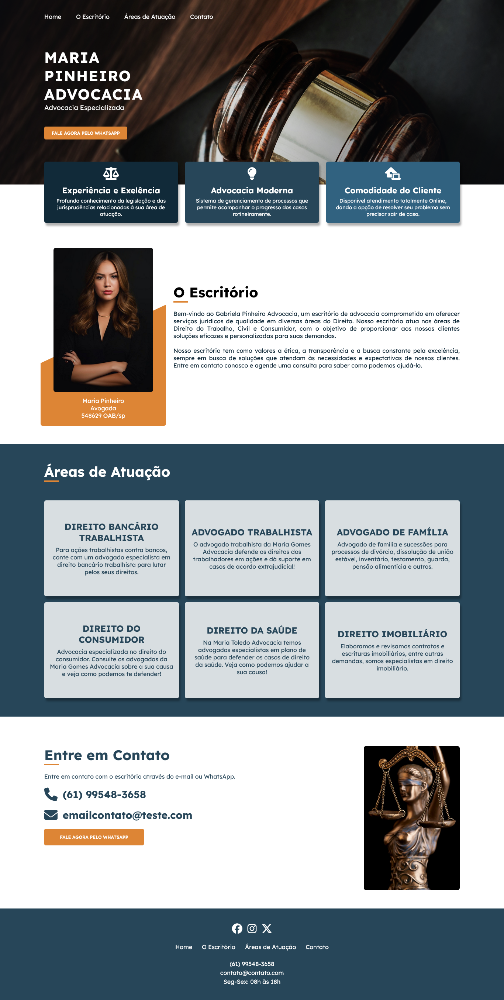

# Maria Pinheiro - Advocacia ⚖️

Este repositório contém o código-fonte do site da Maria Pinheiro Advocacia, um escritório de advocacia especializado em diversas áreas do Direito. O projeto foi desenvolvido utilizando HTML, CSS e JavaScript.

## Estrutura do Projeto 📝

- **SCSS:** O estilo do site é definido no arquivo `style.css`.
- **JavaScript:** As interações dinâmicas do site são gerenciadas pelo arquivo `script.js`.
- **Fontes Externas:** O projeto utiliza a fonte "Lexend" do Google Fonts e o conjunto de ícones FontAwesome (v6.5.1).
- **Imagens:** As imagens utilizadas no site estão armazenadas na pasta `/assets`.

## Funcionalidades Principais  🔥

- **Menu Responsivo:** Implementação de um menu responsivo para facilitar a navegação em dispositivos móveis.
- **Seções Dinâmicas:** O site conta com seções dinâmicas, como a apresentação do escritório, áreas de atuação e formas de contato.
- **Estilo Moderno:** Utilização de fontes e estilos modernos para proporcionar uma experiência visual atraente.